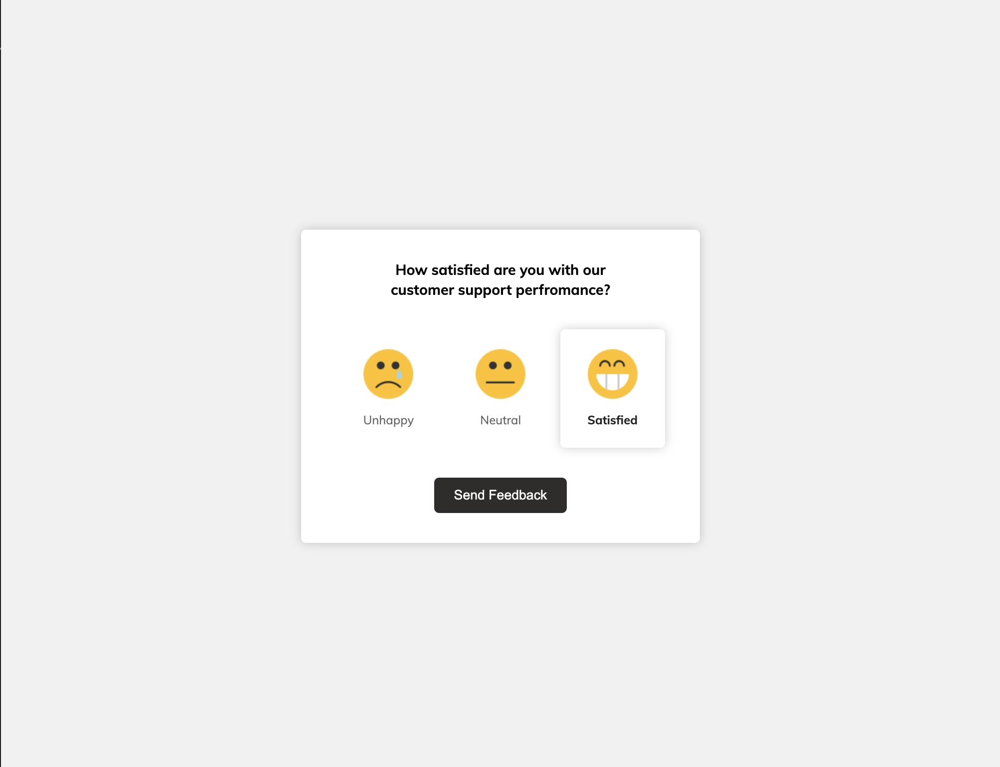

# User Satisfaction UI



An interactive and intuitive user interface to collect customer satisfaction feedback. Built with HTML, CSS, and JavaScript, this project allows users to select their satisfaction level and submit feedback, dynamically updating the UI with a personalized thank-you message. It’s a simple yet effective way to engage users and gather insights about their experience.

## Key Features
- **Interactive Feedback Options**: Users can select from three satisfaction levels (Unhappy, Neutral, Satisfied).
- **Dynamic Response Messages**: Personalized thank-you messages are displayed based on the user’s feedback.
- **Responsive UI**: Clean and modern design, optimized for all devices.
- **Smooth Animations**: Hover and click effects for a more engaging user experience.

## Technologies Used
- **Frontend**: HTML, CSS (with modern and responsive styling).
- **JavaScript**: Handles feedback selection and dynamic message rendering.

## How to Run
1. Clone the repository:
   ```bash
   git clone https://github.com/yourusername/User-Satisfaction-UI.git
   cd User-Satisfaction-UI
   ```
2. Open `index.html` in your browser to interact with the application.

## Live Demo
Check out the live demo [here](https://chrisroland.github.io/User-Satisfaction-UI/)

## Contributions
- Feel free to **open issues** for any bugs or feature suggestions.
- **Pull requests** are welcome for improvements or additional features.
- This project is **open-sourced**, and I appreciate **constructive feedback** and **collaborations**!

Thank you! ❤️